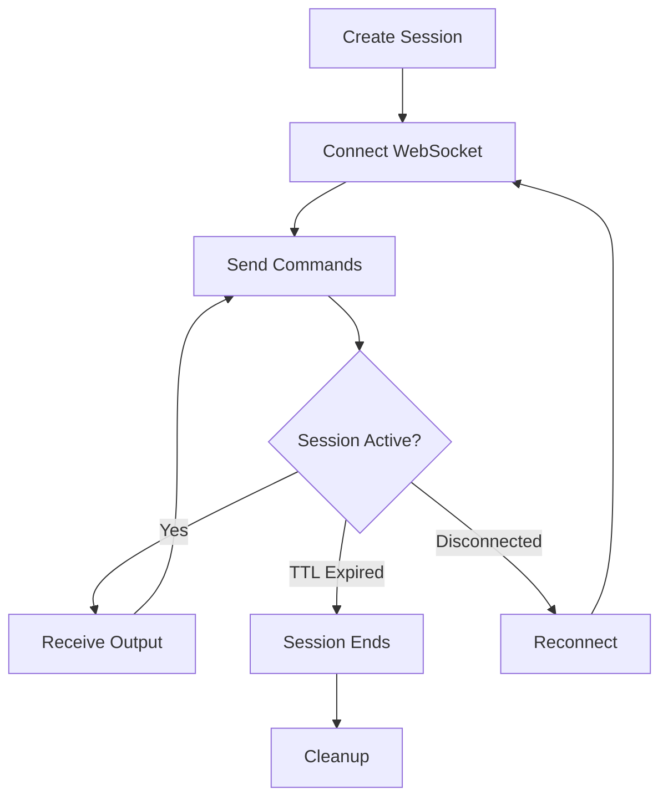

# Terminal TUI - Long-Running Stable Sessions Guide

## 🎯 Overview

This guide provides step-by-step instructions for starting and maintaining **stable, long-running interactive terminal sessions** using the Advanced Terminal Service.

---

## 📋 Prerequisites

### Required Components
- ✅ Advanced Terminal Service running (port 8081)
- ✅ Redis server running (port 6379)
- ✅ Python 3.11+ with dependencies installed
- ✅ PowerShell, CMD, or WSL available

### Quick Health Check
```powershell
# Check if service is running
curl.exe http://localhost:8081/api/v1/health

# Check if Redis is running
redis-cli ping
# Should return: PONG
```

---

## 🚀 Step-by-Step: Starting a Stable Session

### Step 1: Start Redis (If Not Running)

**Option A: Using WSL (Recommended)**
```powershell
# Start Redis in background
wsl bash -c "redis-server --daemonize yes --bind 0.0.0.0"

# Verify
wsl bash -c "redis-cli ping"
```

**Option B: Using Portable Redis for Windows**
```powershell
# Download and start (if already extracted)
Start-Process .\redis\redis-server.exe

# Verify in another terminal
.\redis\redis-cli.exe ping
```

### Step 2: Start the Terminal Service

```powershell
cd backend\terminal_service

# Start service with auto-reload
python run.py

# Output should show:
# ✓ Service running on http://0.0.0.0:8081
# ✓ Application startup complete
```

### Step 3: Create a Terminal Session

**Method A: Using PowerShell (Recommended)**
```powershell
# Create a new PowerShell session
$session = Invoke-RestMethod -Uri http://localhost:8081/api/v1/sessions `
    -Method Post `
    -ContentType "application/json" `
    -Body '{"shell":"powershell","rows":30,"cols":120}'

# Save the session ID
$sessionId = $session.session_id
Write-Host "Session ID: $sessionId"
Write-Host "WebSocket URL: ws://localhost:8081$($session.websocket_url)"
```

**Method B: Using curl**
```powershell
curl.exe -X POST http://localhost:8081/api/v1/sessions `
    -H "Content-Type: application/json" `
    -d "{\"shell\":\"powershell\",\"rows\":30,\"cols\":120}"
```

**Method C: Using Interactive TUI**
```powershell
python tests/interactive_tui.py
# Choose option 1: Create PowerShell session
```

### Step 4: Connect to the Session via WebSocket

**Using Python WebSocket Client:**
```python
import asyncio
import websockets
import json
import base64

async def connect_terminal(session_id):
    uri = f"ws://localhost:8081/ws/terminal/{session_id}"
    
    async with websockets.connect(uri) as ws:
        print(f"Connected to session: {session_id}")
        
        # Send a command
        command = "echo 'Hello from terminal!'\n"
        encoded = base64.b64encode(command.encode()).decode()
        await ws.send(json.dumps({
            "type": "input",
            "data": encoded
        }))
        
        # Receive output
        while True:
            msg = await ws.recv()
            data = json.loads(msg)
            
            if data.get("type") == "output":
                output = base64.b64decode(data["data"]).decode('utf-8', errors='ignore')
                print(output, end="")

# Run
asyncio.run(connect_terminal("YOUR_SESSION_ID_HERE"))
```

---

## ⚡ Maintaining Stable Long-Running Sessions

### Configuration for Stability

#### 1. **Increase Session TTL**
Edit `.env` file:
```ini
# Default: 3600 seconds (1 hour)
SESSION_TTL_SECONDS=86400  # 24 hours for long-running sessions
```

#### 2. **WebSocket Keep-Alive**
The service automatically sends:
- **Ping/Pong**: Every 30 seconds
- **Heartbeat**: Every 60 seconds
- **Connection Monitoring**: Continuous health checks

#### 3. **Enable Session Recovery**
Sessions automatically support reconnection:
```python
# Reconnect to existing session with output replay
uri = f"ws://localhost:8081/ws/terminal/{session_id}?recover_from=last_sequence"
```

### Best Practices for Long-Running Sessions

#### ✅ DO:
1. **Monitor Session Health**
   ```powershell
   # Check session status every 5 minutes
   while ($true) {
       $session = Invoke-RestMethod -Uri "http://localhost:8081/api/v1/sessions/$sessionId"
       Write-Host "Session uptime: $($session.uptime)s"
       Start-Sleep -Seconds 300
   }
   ```

2. **Extend Session TTL Periodically**
   ```powershell
   # Extend TTL by sending a resize (keeps session active)
   Invoke-RestMethod -Uri "http://localhost:8081/api/v1/sessions/$sessionId/resize" `
       -Method Put `
       -ContentType "application/json" `
       -Body '{"rows":30,"cols":120}'
   ```

3. **Handle Disconnections Gracefully**
   ```python
   async def robust_connect(session_id):
       max_retries = 5
       retry_delay = 2
       
       for attempt in range(max_retries):
           try:
               uri = f"ws://localhost:8081/ws/terminal/{session_id}"
               async with websockets.connect(uri) as ws:
                   # Your terminal logic here
                   pass
           except Exception as e:
               print(f"Attempt {attempt + 1} failed: {e}")
               await asyncio.sleep(retry_delay)
               retry_delay *= 2  # Exponential backoff
   ```

#### ❌ DON'T:
1. Don't let client go idle for > 1 hour without activity
2. Don't ignore ping/pong messages
3. Don't create sessions without cleanup plans
4. Don't run resource-intensive commands without monitoring

---

## 🔧 Troubleshooting Long-Running Sessions

### Issue 1: Session Expires After 1 Hour

**Solution:**
```powershell
# Option A: Increase TTL globally (.env file)
SESSION_TTL_SECONDS=86400

# Option B: Send periodic keepalive commands
while ($true) {
    # Send harmless command every 30 minutes
    # (via WebSocket or resize endpoint)
    Start-Sleep -Seconds 1800
}
```

### Issue 2: WebSocket Disconnects

**Solution:**
```python
# Implement automatic reconnection
async def auto_reconnect(session_id):
    last_sequence = 0
    
    while True:
        try:
            uri = f"ws://localhost:8081/ws/terminal/{session_id}?recover_from={last_sequence}"
            async with websockets.connect(uri) as ws:
                # Your logic
                pass
        except websockets.ConnectionClosed:
            print("Reconnecting in 5s...")
            await asyncio.sleep(5)
```

### Issue 3: Redis Connection Lost

**Solution:**
```powershell
# Monitor Redis health
while ($true) {
    $ping = redis-cli ping 2>&1
    if ($ping -notlike "*PONG*") {
        Write-Host "Redis down! Restarting..."
        # Restart Redis
    }
    Start-Sleep -Seconds 60
}
```

### Issue 4: PTY Process Crashes

**Solution:**
```powershell
# Monitor process health
$session = Invoke-RestMethod -Uri "http://localhost:8081/api/v1/sessions/$sessionId"
if (-not $session.pid) {
    Write-Host "Session crashed! Creating new one..."
    # Create new session
}
```

---

## 📊 Monitoring Dashboard Example

```powershell
# Real-time monitoring script
function Show-TerminalDashboard {
    param($SessionId)
    
    while ($true) {
        Clear-Host
        
        # Get session info
        $session = Invoke-RestMethod -Uri "http://localhost:8081/api/v1/sessions/$SessionId"
        
        Write-Host "=== Terminal Session Dashboard ===" -ForegroundColor Cyan
        Write-Host "Session ID: $($session.session_id)"
        Write-Host "Shell: $($session.shell)"
        Write-Host "PID: $($session.pid)"
        Write-Host "Size: $($session.rows)x$($session.cols)"
        Write-Host "Uptime: $([math]::Round($session.uptime / 60, 2)) minutes"
        Write-Host "Last Activity: $(Get-Date -UnixTimeSeconds $session.last_activity -Format 'HH:mm:ss')"
        Write-Host ""
        
        # Health checks
        Write-Host "Health Checks:" -ForegroundColor Yellow
        $health = Invoke-RestMethod -Uri http://localhost:8081/api/v1/health
        Write-Host "  Service: $($health.status)"
        Write-Host "  Active Sessions: $($health.active_sessions)"
        
        Start-Sleep -Seconds 5
    }
}

# Usage
Show-TerminalDashboard -SessionId "YOUR_SESSION_ID"
```

---

## 🎮 Complete Example: 24-Hour Stable Session

```powershell
# 1. Start infrastructure
Write-Host "Starting infrastructure..." -ForegroundColor Cyan
wsl bash -c "redis-server --daemonize yes"
Start-Process python -ArgumentList "run.py" -WorkingDirectory "backend\terminal_service"
Start-Sleep -Seconds 5

# 2. Create session with 24-hour TTL
$body = @{
    shell = "powershell"
    rows = 30
    cols = 120
} | ConvertTo-Json

$session = Invoke-RestMethod -Uri http://localhost:8081/api/v1/sessions `
    -Method Post `
    -ContentType "application/json" `
    -Body $body

$sessionId = $session.session_id
Write-Host "Created session: $sessionId" -ForegroundColor Green

# 3. Setup keepalive job
$keepalive = Start-Job -ScriptBlock {
    param($SessionId)
    while ($true) {
        try {
            # Send resize to keep session alive
            Invoke-RestMethod -Uri "http://localhost:8081/api/v1/sessions/$SessionId/resize" `
                -Method Put `
                -ContentType "application/json" `
                -Body '{"rows":30,"cols":120}' `
                -ErrorAction SilentlyContinue
        } catch {
            Write-Host "Keepalive failed: $_"
        }
        Start-Sleep -Seconds 1800  # Every 30 minutes
    }
} -ArgumentList $sessionId

Write-Host "Keepalive job started" -ForegroundColor Green

# 4. Connect and use terminal
# (Your WebSocket client code here)

# 5. Cleanup when done
# Stop-Job $keepalive
# Remove-Job $keepalive
# Invoke-RestMethod -Uri "http://localhost:8081/api/v1/sessions/$sessionId" -Method Delete
```

---

## 📝 Session Lifecycle Management



---

## 🔐 Security for Long-Running Sessions

1. **Use Authentication** (Phase 5 - Coming Soon)
   - OAuth2/JWT tokens
   - Session-specific API keys
   - RBAC for terminal access

2. **Network Security**
   - Use WSS (WebSocket Secure) in production
   - Firewall rules for ports 6379 and 8081
   - VPN for remote access

3. **Resource Limits**
   - Max sessions per user
   - CPU/memory limits per session
   - Output buffer size limits

---

## 📚 Advanced Topics

### Custom Session Configuration

```python
# Create session with custom environment
custom_session = {
    "shell": "powershell",
    "rows": 40,
    "cols": 160,
    "env": {
        "CUSTOM_VAR": "production",
        "PATH": "/custom/path:$PATH"
    },
    "user_id": "user123"
}
```

### Session Sharing (Multi-User)

```python
# User A creates session
session_id = "shared-session-id"

# User B connects to same session
# Both see the same terminal output
uri = f"ws://localhost:8081/ws/terminal/{session_id}"
```

### Output Recording

```python
# Record all session output to file
output_file = open(f"session_{session_id}.log", "wb")

async with websockets.connect(uri) as ws:
    async for message in ws:
        data = json.loads(message)
        if data.get("type") == "output":
            output = base64.b64decode(data["data"])
            output_file.write(output)
```

---

## 🎯 Quick Reference Commands

```powershell
# Create session
$s = Invoke-RestMethod -Uri http://localhost:8081/api/v1/sessions -Method Post -Body '{"shell":"powershell"}' -ContentType "application/json"

# Get session
Invoke-RestMethod -Uri "http://localhost:8081/api/v1/sessions/$($s.session_id)"

# List all sessions
Invoke-RestMethod -Uri http://localhost:8081/api/v1/sessions

# Resize session
Invoke-RestMethod -Uri "http://localhost:8081/api/v1/sessions/$($s.session_id)/resize" -Method Put -Body '{"rows":40,"cols":160}' -ContentType "application/json"

# Delete session
Invoke-RestMethod -Uri "http://localhost:8081/api/v1/sessions/$($s.session_id)" -Method Delete

# Health check
Invoke-RestMethod -Uri http://localhost:8081/api/v1/health
```

---

## 🆘 Support & Resources

- **API Documentation**: http://localhost:8081/docs
- **Service Health**: http://localhost:8081/api/v1/health
- **Logs**: Check terminal_service logs for debugging
- **Prometheus Metrics**: http://localhost:9090 (if enabled)

---

**Built with ❤️ for stable, production-grade terminal sessions**
