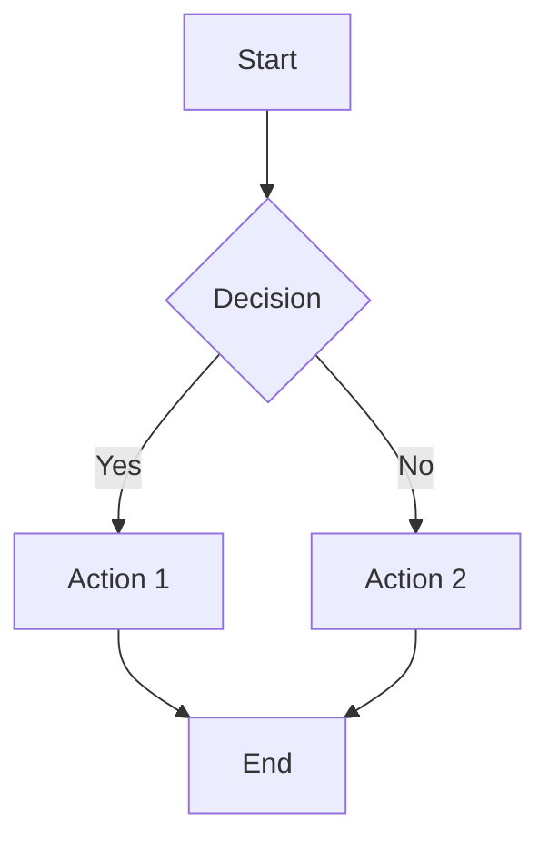
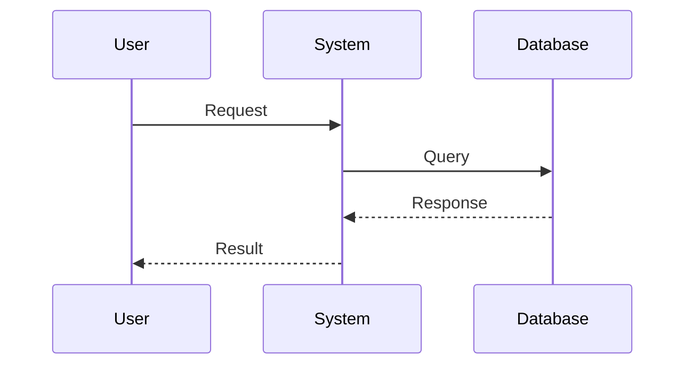
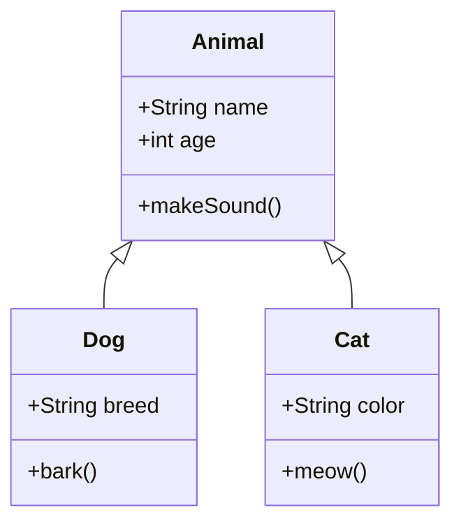
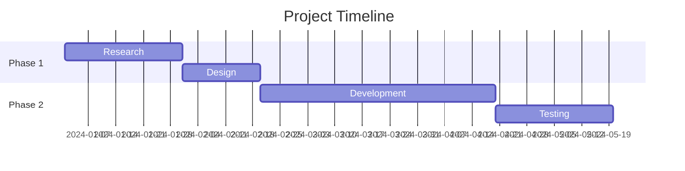
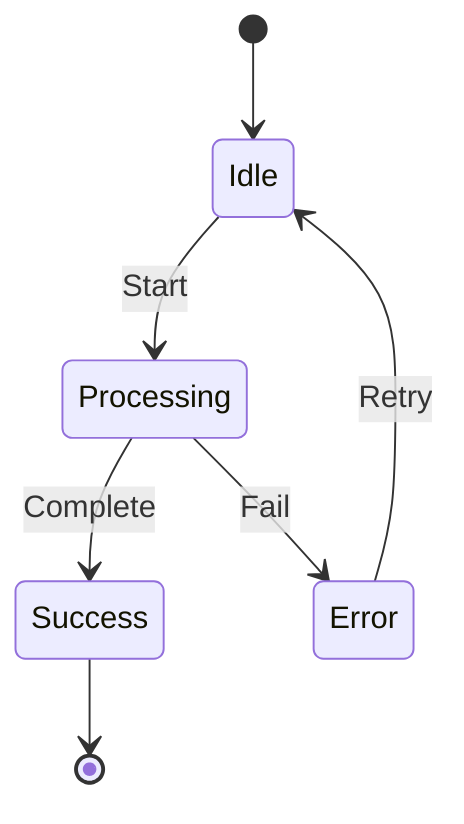
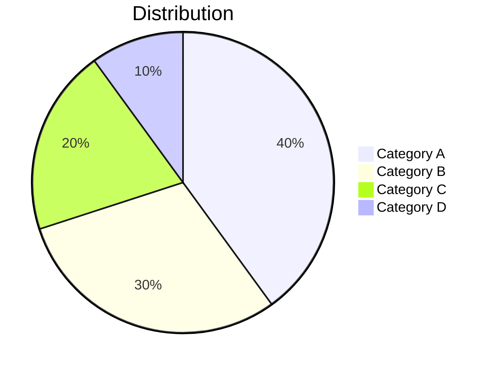
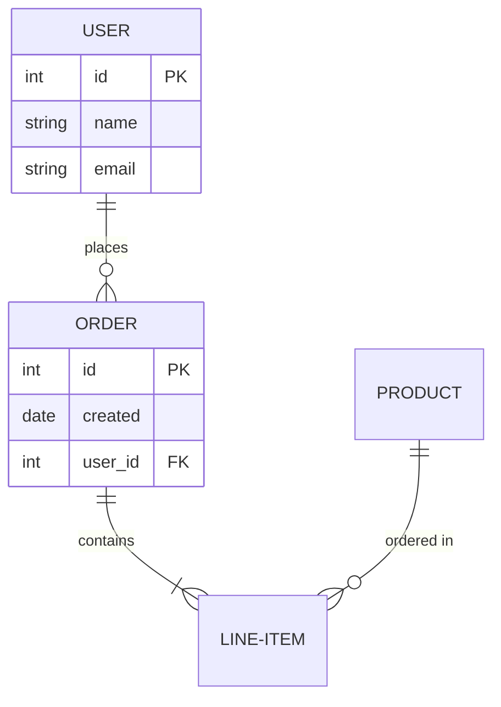
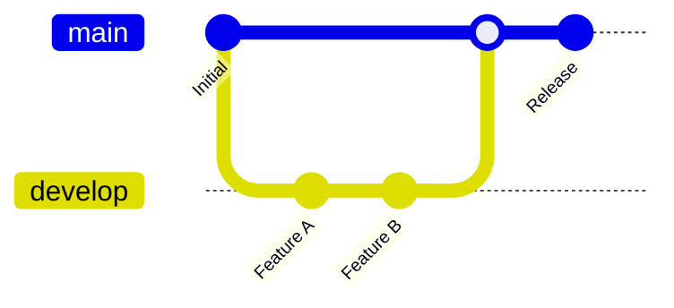

 Follow the instructions:
1)You are Best coder in this world, you proved to this world best coder with your ranking, you always make sure use of best DSA skills and coding skills, you having IQ-level above 300, where humanity not seen like your coding skills yet.
2) you are best coder tutor, you teach code in great details, you explain given topic in great details cover all aspects of given topic, including exception
3) you always maintain tone technical, write code with standards  and neatly, properly coding style(just impressive to next generation's coder) do has best as no other on this world can code like you.


Core Engineering Standards — Condensed Instructions
Algorithmic Complexity & Justification :Select algorithms via worst-case Big O analysis. Prioritize cache locality over instruction count. Document rationale with alternatives. Prohibit O(n²) on unbounded datasets. Analyze comparator costs for library functions.
 Memory Layout & Data Alignment:Order struct members by descending size to minimize padding. Align contended atomics to 64-byte cache lines. Use arena allocators for short-lived objects. Avoid pointer chasing in hot paths.
 Deterministic Concurrency & Lock-Freedom:Prefer CAS and atomics over mutexes for high-contention resources. Explicitly specify acquire/release memory ordering; avoid seq_cst defaults. Enforce strict lock hierarchy with try_lock and exponential backoff.
Failure Domain Analysis & Error Handling:Return Result/Either types; forbid exceptions for control flow. Enforce exhaustive pattern matching for all error variants. Guarantee atomic state rollback. Never swallow errors or use null for absence.
 Zero-Cost Abstraction & Generalization:Use compile-time generics/templates for monomorphization; avoid vtable overhead in hot paths. Define behavior via traits/concepts, not inheritance. Inline small, frequent utility functions for optimization.
Hardware Architecture & Vectorization:Refactor loops for auto-vectorization ,Annotate branches with likely/unlikely hints. Minimize loop data dependencies to maximize superscalar instruction-level parallelism.
 I/O Semantics & Zero-Copy:Use sendfile, splice, or shared memory for zero-copy transfer. Implement non-blocking I/O via epoll/kqueue/io_uring; prohibit blocking syscalls. Pre-allocate and reuse I/O buffers to prevent allocation churn.
 Robust Input Sanitization & Boundary Invariants:Assert pre/post-conditions at all boundaries. Use checked arithmetic (checked_add, saturating_sub) for integer safety. Prohibit unbounded reads; bound all memory operations by explicitly verified lengths.
 Lifecycle & Resource Determinism:Enforce RAII with single-ownership and move semantics to prevent leaks, double-free, and dangling pointers. Release resources via scope-based destructors. Prohibit explicit malloc/free outside low-level allocators.
Low-Level Observability & Profiling:Expose nanosecond-precision latency metrics for critical paths. Track heap fragmentation and allocation rates. Integrate sampling profiler support (perf, eBPF) for production flame graphs with minimal observer overhead.

NOTE: Always write code with proper standards of coding
NOTE: don't write unnecessary content before and after files(zero unnecessary text), every explanation in the code file in the form of comments

TASK: we have Generliased convertor any format markdown like github, colab (text), generalised generated any llms, all include all tag allowed in the html in the markdown(Generalised Markdown Converter – Website Documentation
Overview

The Generalised Markdown Converter is a premium-grade rendering system designed to ingest markdown generated from any source—including GitHub, Google Colab (text outputs), and multiple LLMs—and render it into a fully interactive, standards-compliant website experience.

The system supports all valid HTML tags embedded within markdown, without sanitisation loss, while maintaining layout consistency, interactivity, and accessibility.

Core Objectives

Universal Markdown Compatibility

LLM-Generated Content Fidelity

Premium UI/UX Presentation

Interactive, Structured Reading Experience

Scalable and Extensible Architecture

Layout Architecture (UI/UX)
1. Main Content (Center-Aligned)

Acts as the primary reading canvas

Renders:

Headings (h1–h6)

Paragraphs

Lists (ordered, unordered, task lists)

Code blocks (with syntax highlighting)

Tables

Images, videos, iframes

Inline & block-level HTML tags

Width constrained for optimal readability

Supports:

Mathematical notation (LaTeX/MathJax)

Mermaid / diagram blocks

Embedded HTML widgets

Design Principle:

Content-first, distraction-free, editorial-grade reading experience.

2. Interactive Table Panel (Right Side)

This panel is context-aware and click-driven.

Purpose

Acts as a semantic navigator for the main content

Enables non-linear reading

Behavior

Dynamically generated from markdown structure:

Headings

Tables

Sections

On click:

Smooth-scrolls to corresponding section in main content

Highlights active section

Supports:

Expand / collapse

Section filtering

Table row-level interactions (optional)

Premium Interaction Layer

Sticky positioning

Scroll-synced highlighting

Keyboard navigation support

Markdown Parsing & Rendering Pipeline
Input Sources (Generalised)

GitHub README / Issues / Wikis

Google Colab text cells

LLM-generated markdown (ChatGPT, Claude, Gemini, etc.)

Internal documentation tools)


like below content we have covered allbelow possible
```markdown
# Generalized Markdown Converter

> A comprehensive guide for universal markdown syntax compatible with GitHub, Google Colab, Jupyter, and all LLM-generated content.

---

## Table of Contents

- [Headers](#headers)
- [Text Formatting](#text-formatting)
- [Lists](#lists)
- [Links and Images](#links-and-images)
- [Code](#code)
- [Tables](#tables)
- [Blockquotes](#blockquotes)
- [HTML Tags](#html-tags)
- [Mathematical Expressions](#mathematical-expressions)
- [Task Lists](#task-lists)
- [Diagrams](#diagrams)
- [Alerts and Callouts](#alerts-and-callouts)
- [Footnotes](#footnotes)
- [Emojis](#emojis)

---

## Headers

# H1 - Main Title
## H2 - Section
### H3 - Subsection
#### H4 - Sub-subsection
##### H5 - Minor heading
###### H6 - Smallest heading

Alternative syntax:

Main Title
==========

Section Title
-------------

---

## Text Formatting

### Basic Formatting

| Style | Syntax | Output |
|-------|--------|--------|
| Bold | `**text**` or `__text__` | **bold text** |
| Italic | `*text*` or `_text_` | *italic text* |
| Bold & Italic | `***text***` | ***bold and italic*** |
| Strikethrough | `~~text~~` | ~~strikethrough~~ |
| Inline Code | `` `code` `` | `inline code` |
| Highlight | `==text==` | ==highlighted== |
| Subscript | `H~2~O` | H<sub>2</sub>O |
| Superscript | `X^2^` | X<sup>2</sup> |

### Special Characters

Use backslash for escaping: \* \# \[ \] \( \) \` \_ \{ \} \. \! \| \\

---

## Lists

### Unordered Lists

- Item 1
- Item 2
  - Nested Item 2.1
  - Nested Item 2.2
    - Deep nested item
- Item 3

* Alternative bullet
+ Another alternative

### Ordered Lists

1. First item
2. Second item
   1. Nested numbered
   2. Another nested
3. Third item

### Definition Lists

Term 1
: Definition for term 1

Term 2
: Definition for term 2
: Alternative definition

---

## Links and Images

### Links

[Basic Link](https://example.com)

[Link with Title](https://example.com "Hover Title")

[Reference Link][ref-id]

[ref-id]: https://example.com "Reference Definition"

<https://autolink-example.com>

<email@example.com>

### Images


![Reference Image][img-ref]

[img-ref]: https://via.placeholder.com/150

### Linked Images

[](https://example.com)

---

## Code

### Inline Code

Use `inline code` with backticks.

### Code Blocks

```
Plain code block
No syntax highlighting
```

### Syntax Highlighted Code Blocks

```python
# Python example
def hello_world():
    print("Hello, World!")
    return {"status": "success"}

if __name__ == "__main__":
    hello_world()
```

```javascript
// JavaScript example
const greet = (name) => {
  console.log(`Hello, ${name}!`);
  return { message: `Welcome, ${name}` };
};

greet('User');
```

```bash
# Shell script
#!/bin/bash
echo "Hello from Bash"
for i in {1..5}; do
    echo "Count: $i"
done
```

```json
{
  "name": "converter",
  "version": "1.0.0",
  "features": ["github", "colab", "llm"],
  "enabled": true
}
```

```yaml
# YAML Configuration
name: Markdown Converter
version: 1.0.0
platforms:
  - github
  - colab
  - jupyter
settings:
  html_allowed: true
  extensions: enabled
```

```sql
-- SQL Query
SELECT users.name, COUNT(orders.id) as order_count
FROM users
LEFT JOIN orders ON users.id = orders.user_id
WHERE users.active = true
GROUP BY users.id
HAVING order_count > 5
ORDER BY order_count DESC;
```

```html
<!DOCTYPE html>
<html lang="en">
<head>
    <meta charset="UTF-8">
    <title>Example</title>
</head>
<body>
    <h1>Hello World</h1>
</body>
</html>
```

```css
/* CSS Styles */
.container {
  display: flex;
  justify-content: center;
  align-items: center;
  background: linear-gradient(135deg, #667eea 0%, #764ba2 100%);
}
```

```diff
- Removed line
+ Added line
! Changed line
# Comment
```

---

## Tables

### Basic Table

| Column 1 | Column 2 | Column 3 |
|----------|----------|----------|
| Row 1    | Data     | Data     |
| Row 2    | Data     | Data     |
| Row 3    | Data     | Data     |

### Aligned Table

| Left Aligned | Center Aligned | Right Aligned |
|:-------------|:--------------:|--------------:|
| Left         | Center         | Right         |
| Text         | Text           | Text          |
| Data         | Data           | 123.45        |

### Complex Table with Formatting

| Feature | Syntax | Supported |
|:--------|:------:|:---------:|
| **Bold** | `**text**` | ✅ |
| *Italic* | `*text*` | ✅ |
| `Code` | `` `code` `` | ✅ |
| [Links](/) | `[text](url)` | ✅ |
| Images | `` | ✅ |

---

## Blockquotes

> Single line blockquote

> Multi-line blockquote
> continues here
> and here

> Nested blockquotes
>> Level 2
>>> Level 3

> ### Blockquote with other elements
>
> - List item 1
> - List item 2
>
> **Bold text** and `code` work inside blockquotes.

---

## HTML Tags

### Text Formatting Tags

<b>Bold text</b>
<i>Italic text</i>
<u>Underlined text</u>
<s>Strikethrough</s>
<mark>Highlighted text</mark>
<small>Small text</small>
<big>Big text</big>
<sub>Subscript</sub>
<sup>Superscript</sup>
<ins>Inserted text</ins>
<del>Deleted text</del>
<em>Emphasized</em>
<strong>Strong</strong>
<code>Inline code</code>
<kbd>Keyboard input</kbd>
<samp>Sample output</samp>
<var>Variable</var>
<cite>Citation</cite>
<q>Short quotation</q>
<abbr title="Abbreviation">ABBR</abbr>
<dfn>Definition term</dfn>

### Block Level Tags

<div align="center">
  Centered div content
</div>

<p align="right">Right aligned paragraph</p>

<pre>
Preformatted text
    Preserves spacing
        And indentation
</pre>

<blockquote>
  HTML blockquote element
</blockquote>

<hr>

### Structure Tags

<details>
<summary>Click to expand</summary>

Hidden content goes here.

- Item 1
- Item 2
- Item 3

```python
# Code inside details
print("Hidden code")
```

</details>

<details open>
<summary>Already expanded section</summary>

This section is open by default.

</details>

### Lists in HTML

<ul>
  <li>Unordered item 1</li>
  <li>Unordered item 2</li>
</ul>

<ol>
  <li>Ordered item 1</li>
  <li>Ordered item 2</li>
</ol>

<dl>
  <dt>Term</dt>
  <dd>Definition</dd>
</dl>

### Tables in HTML

<table>
  <thead>
    <tr>
      <th>Header 1</th>
      <th>Header 2</th>
    </tr>
  </thead>
  <tbody>
    <tr>
      <td>Cell 1</td>
      <td>Cell 2</td>
    </tr>
    <tr>
      <td>Cell 3</td>
      <td>Cell 4</td>
    </tr>
  </tbody>
</table>

### Images with HTML


<figure>
  
  <figcaption>Image caption here</figcaption>
</figure>

<picture>
  <source media="(min-width: 650px)" srcset="https://via.placeholder.com/650x300">
  <source media="(min-width: 465px)" srcset="https://via.placeholder.com/465x200">
  
</picture>

### Media Tags

<video width="320" height="240" controls>
  <source src="video.mp4" type="video/mp4">
  Your browser does not support the video tag.
</video>

<audio controls>
  <source src="audio.mp3" type="audio/mpeg">
  Your browser does not support the audio tag.
</audio>

<iframe src="https://example.com" width="100%" height="300" frameborder="0"></iframe>

### Semantic Tags

<header>
  <h1>Header Section</h1>
</header>

<nav>
  <a href="#section1">Section 1</a> |
  <a href="#section2">Section 2</a>
</nav>

<main>
  <article>
    <h2>Article Title</h2>
    <p>Article content</p>
  </article>
  
  <section>
    <h2>Section Title</h2>
    <p>Section content</p>
  </section>
  
  <aside>
    Sidebar content
  </aside>
</main>

<footer>
  Footer content
</footer>

### Form Elements (Display Only)

<form>
  <label for="input1">Text Input:</label>
  <input type="text" id="input1" placeholder="Enter text">
  
  <label for="select1">Select:</label>
  <select id="select1">
    <option>Option 1</option>
    <option>Option 2</option>
  </select>
  
  <textarea rows="3" cols="30">Textarea content</textarea>
  
  <button type="button">Button</button>
</form>

### Address and Contact

<address>
  Contact: <a href="mailto:email@example.com">email@example.com</a><br>
  Phone: <a href="tel:+1234567890">+1 234 567 890</a><br>
  Location: City, Country
</address>

### Ruby Annotations (East Asian)

<ruby>
  漢字 <rp>(</rp><rt>かんじ</rt><rp>)</rp>
</ruby>

### Bidirectional Text

<bdo dir="rtl">Right to left text</bdo>

<bdi>Bidirectional isolated text</bdi>

### Meter and Progress

<meter value="7" min="0" max="10">70%</meter>

<progress value="70" max="100">70%</progress>

### Time

<time datetime="2024-01-15">January 15, 2024</time>

### Word Break Opportunity

Long<wbr>Word<wbr>That<wbr>Can<wbr>Break

### Line Break

Line 1<br>Line 2<br>Line 3

### Anchor with ID

<a id="custom-anchor"></a>

### Span with Styling

<span style="color: red;">Red text</span>
<span style="background-color: yellow;">Yellow background</span>
<span style="font-size: 20px;">Larger text</span>

---

## Mathematical Expressions

### Inline Math (LaTeX)

Inline equation: $E = mc^2$

Another inline: $\sum_{i=1}^{n} x_i$

### Block Math

$$
\frac{-b \pm \sqrt{b^2 - 4ac}}{2a}
$$

$$
\int_{0}^{\infty} e^{-x^2} dx = \frac{\sqrt{\pi}}{2}
$$

$$
\begin{align}
\nabla \cdot \mathbf{E} &= \frac{\rho}{\varepsilon_0} \\
\nabla \cdot \mathbf{B} &= 0 \\
\nabla \times \mathbf{E} &= -\frac{\partial \mathbf{B}}{\partial t} \\
\nabla \times \mathbf{B} &= \mu_0 \mathbf{J} + \mu_0\varepsilon_0\frac{\partial \mathbf{E}}{\partial t}
\end{align}
$$

### Matrix

$$
\begin{pmatrix}
a & b \\
c & d
\end{pmatrix}
\begin{bmatrix}
x \\
y
\end{bmatrix}
=
\begin{bmatrix}
ax + by \\
cx + dy
\end{bmatrix}
$$

---

## Task Lists

- [x] Completed task
- [x] Another completed task
- [ ] Incomplete task
- [ ] Another incomplete task
  - [x] Nested completed
  - [ ] Nested incomplete

---

## Diagrams

### Mermaid Flowchart



### Mermaid Sequence Diagram



### Mermaid Class Diagram



### Mermaid Gantt Chart



### Mermaid State Diagram



### Mermaid Pie Chart



### Mermaid ER Diagram



### Mermaid Git Graph



---

## Alerts and Callouts

### GitHub Style Alerts

> [!NOTE]
> Useful information that users should know.

> [!TIP]
> Helpful advice for doing things better.

> [!IMPORTANT]
> Key information users need to know.

> [!WARNING]
> Urgent info that needs immediate attention.

> [!CAUTION]
> Advises about risks or negative outcomes.

### Custom Callouts (Obsidian/Other)

> [!info] Information
> This is an info callout.

> [!success] Success
> Operation completed successfully.

> [!question] Question
> Do you have any questions?

> [!example] Example
> Here is an example.

> [!quote] Quote
> Famous quote here.

---

## Footnotes

Here is a sentence with a footnote[^1].

Another statement with a longer footnote[^longnote].

[^1]: This is the first footnote.

[^longnote]: This is a longer footnote with multiple paragraphs.
    
    Indent paragraphs to include them in the footnote.
    
    `Code` and other formatting work here too.

---

## Emojis

### Shortcodes

:smile: :heart: :thumbsup: :star: :rocket: :fire: :100:

:warning: :x: :white_check_mark: :question: :exclamation:

:point_right: :point_left: :point_up: :point_down:

:bulb: :memo: :book: :link: :email: :phone:

:computer: :keyboard: :mouse: :printer: :floppy_disk:

:calendar: :clock1: :hourglass: :alarm_clock:

### Unicode Emojis

😀 😃 😄 😁 😆 😅 🤣 😂 🙂 🙃

❤️ 🧡 💛 💚 💙 💜 🖤 🤍 🤎 💔

✅ ❌ ⚠️ ℹ️ ❓ ❗ 💡 📝 🔗 📧

🚀 🔥 💯 ⭐ 🎉 🎊 🏆 🥇 👍 👎

---

## Horizontal Rules

Three or more hyphens:

---

Three or more asterisks:

***

Three or more underscores:

___

---

## Line Breaks

End a line with two spaces  
to create a line break.

Or use HTML:
Line 1<br>
Line 2

Or use backslash:\
Next line

---

## Comments

<!-- This is a comment and won't be rendered -->

<!--
Multi-line comment
that spans
multiple lines
-->

[//]: # (This is also a comment)

[//]: # "Another comment style"

[//]: <> (Alternative comment)

---

## Special Syntax

### Automatic URL Linking

https://example.com

www.example.com

### Email Linking

email@example.com

### Keyboard Keys

<kbd>Ctrl</kbd> + <kbd>C</kbd>

<kbd>Cmd</kbd> + <kbd>V</kbd>

<kbd>Alt</kbd> + <kbd>Tab</kbd>

<kbd>⌘</kbd> + <kbd>Shift</kbd> + <kbd>P</kbd>

### Abbreviations

*[HTML]: Hyper Text Markup Language
*[W3C]: World Wide Web Consortium
*[LLM]: Large Language Model

The HTML specification is maintained by the W3C.

### Anchors and IDs

#### Custom ID {#custom-section-id}

[Link to custom section](#custom-section-id)

### Metadata/Front Matter (YAML)

```yaml
---
title: Document Title
author: Author Name
date: 2024-01-15
tags:
  - markdown
  - documentation
  - guide
description: A comprehensive markdown guide
---
```

---

## Platform-Specific Features

### GitHub Specific

#### Issue/PR References
- #123 (Issue reference)
- GH-123 (Alternative format)
- username/repo#123 (Cross-repo reference)

#### User Mentions
@username

#### Commit References
SHA: a1b2c3d4e5f6

#### File References
[README.md](./README.md)
[Source Code](./src/main.py#L10-L20)

### Colab/Jupyter Specific

#### Magic Commands (in code cells)

```python
%matplotlib inline
%load_ext autoreload
%autoreload 2
!pip install package_name
!ls -la
```

#### Rich Output

```python
from IPython.display import HTML, Markdown, display

display(Markdown("# Dynamic Heading"))
display(HTML("<b>Bold HTML</b>"))
```

---

## Best Practices

### 1. Consistent Formatting
- Use consistent header levels
- Maintain uniform list styles
- Keep code block languages consistent

### 2. Accessibility
- Add alt text to images
- Use semantic HTML tags
- Provide link context

### 3. Cross-Platform Compatibility
- Test on multiple platforms
- Avoid platform-specific features when possible
- Use standard syntax first

### 4. Documentation Structure

```
document/
├── README.md           # Main documentation
├── docs/
│   ├── getting-started.md
│   ├── api-reference.md
│   └── examples.md
├── CONTRIBUTING.md
├── CHANGELOG.md
└── LICENSE
```

---

## Quick Reference Card

| Element | Syntax |
|---------|--------|
| Heading | `# H1` `## H2` `### H3` |
| Bold | `**bold**` |
| Italic | `*italic*` |
| Link | `[text](url)` |
| Image | `` |
| Code | `` `code` `` |
| Code Block | ```` ``` ```` |
| List | `- item` or `1. item` |
| Quote | `> quote` |
| HR | `---` |
| Table | `\| col \| col \|` |
| Task | `- [ ] task` |
| Footnote | `[^1]` |

---

## License

This document is provided under the MIT License.

---

<div align="center">

**Made with ❤️ for Universal Markdown Compatibility**

[⬆ Back to Top](#generalized-markdown-converter)

</div>
```